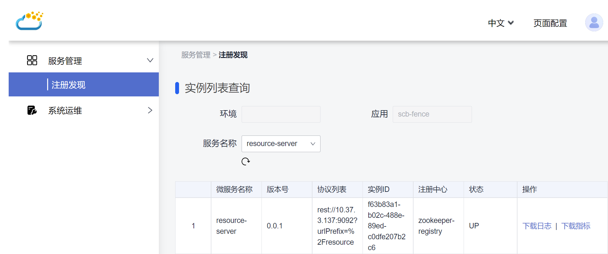

# Fence项目介绍

[ServiceComb Fence](https://github.com/apache/servicecomb-fence) 是包含Java Chassis 3最佳实践的应用开发脚手架，它可以帮助开发者快速构建包含微服务后端、微服务前端和基础原子服务的项目工程。

基于Fence，可以快速构建一个韧性、安全和敏捷的微服务项目工程。Fence的核心设计包括韧性架构、安全认证、可观测性、过载防护等方面，它主要由如下几个微服务组成：

* edge-service: 微服务网关。微服务网关负责接收用户的请求，并将请求转发给对应的微服务前端和微服务后端进行处理。微服务网关还负责认证鉴权、过载防护等方面的系统功能。
* authentication-server: 认证服务。认证服务提供基于Oauth2的认证能力，实现了基础的用户、角色管理，认证和授权等功能。
* resource-server: 资源服务。资源服务是一个示例项目，用户新开发的服务都属于资源服务，这个服务可以作为新增服务的模板。 资源服务实现了一些基础的鉴权功能，提供基于Yaml配置和Java Annotation声明的权限管理机制。 
* admin-service: 微服务管理服务。微服务管理服务提供微服务管理和系统运维功能。包括管理和查看服务列表、管理和查看服务配置、系统问题分析和定位能力。 
* admin-website: 微服务管理服务的前端。这是一个基于 [OpenTiny](https://opentiny.design/) 开发的静态页面服务，实现微服务管理服务的Web前端。 它可以作为用户新增前端的模板，提供了基础的Web前端开发框架，包括菜单、导航等方便阅读和扩展的代码框架。

Fence还依赖中间件服务Zookeeper和数据库MySQL。

Fence项目遵循*约定优于配置*原则，定义了日志配置、Web配置、路由配置、代码结构等相关规范，以更加简洁的实现可观测性、过载防护等功能。 

## 下载和运行Fence项目

在下载和运行Fence项目前，假设您已经体验过Java Chassis的快速入门，并已经安装和设置好JDK 17、Maven、Git、IDEA等开发环境。 

* 下载和安装 [Zookeeper](https://zookeeper.apache.org/releases.html)

  Fence 使用Zookeeper作为注册中心和配置中心，可以参考官网链接下载和安装。

* 下载和安装 [MySQL](https://www.mysql.com/downloads/)

  Fence 使用MySQL作为数据库，可以参考官网链接下载和安装。

* 下载和安装OpenTiny(可选)
  
  Fence前端框架使用OpenTiny要修改编译源码需要下载和安装OpenTiny相关开发环境。详细可以参考[Open Tiny Pro的官网说明](https://opentiny.design/vue-pro/docs/start) 。

* 下载Fence代码并编译

        ```
        git clone https://github.com/apache/servicecomb-fence.git
        cd servicecomb-fence
        mvn clean install
        ```

* 初始化数据库

  authentication-server依赖数据库，找到 src/resource/sql/user.sql，在数据库执行该初始化脚本。

* 启动和运行

  可以使用 `build_and_run.bat` 脚本启动项目，也可以使用 IDEA 打开 Fence工程，启动Fence的每个微服务。

* 进入Fence管理界面。
  
  输入：http://localhost:9090/ui/admin/ , 登录系统后可以看到如下界面
  

## 后续

在接下来的内容里面，我们将逐步从韧性架构设计、安全认证设计、可观测性设计、过载防护设计、契约优先开发、项目脚手架等方面，专题介绍Fence项目。
