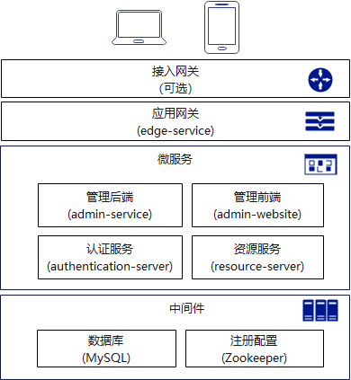
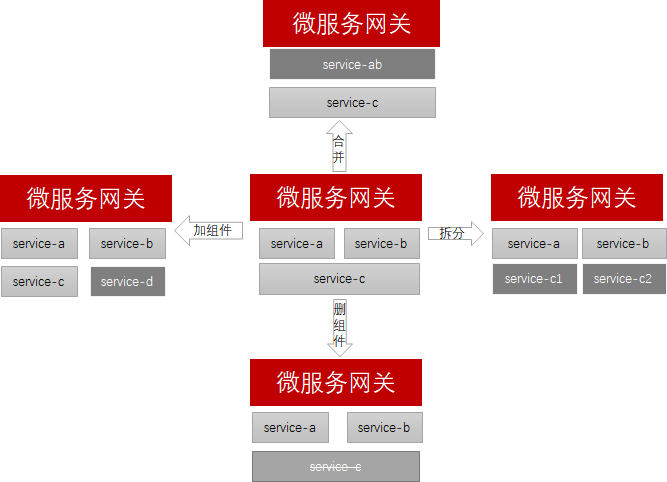
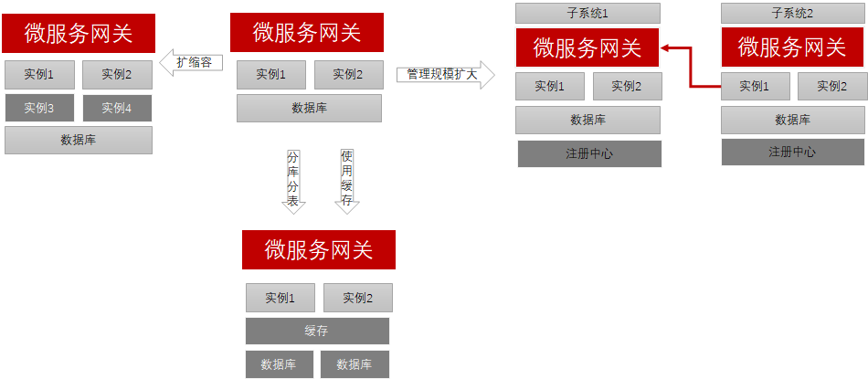
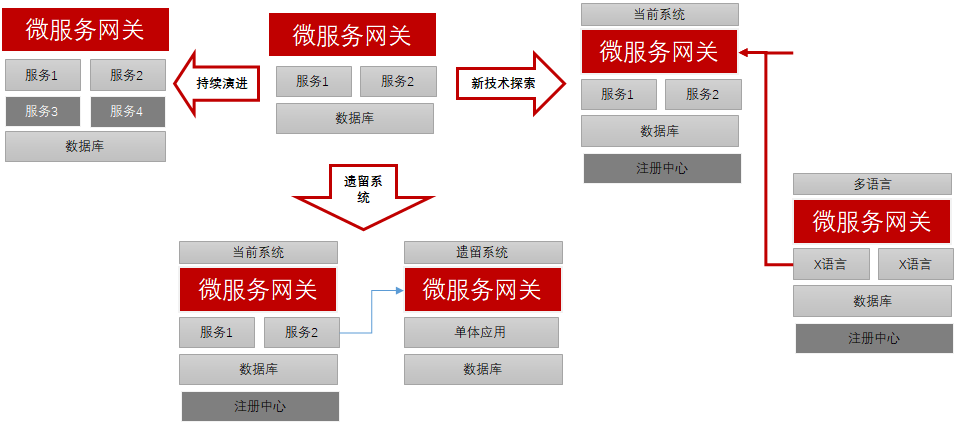

# 韧性架构设计

架构设计的目的是解决软件系统复杂性带来的问题。简单描述为如下几个业务目标：

* 业务变化不需要改变架构。新增业务、修改业务或者删除业务，不需要调整架构。这样业务团队能够专注于业务开发和运营，降低技术难度，提升开发效率。同时满足业务创新对于试错的诉求，快速创建新的业务模块，快速丢弃被验证不合理的业务，降低创新成本，也不至于对稳定业务造成影响。
* 适应业务增长对于性能的要求。用户增长、营收增长、业务增长以及使用场景变化，不需要调整架构，能够快速适应。比如通过资源投入的线性增长，就能快速满足用户增长的需要，不需要修改架构和代码，这样业务团队可以聚焦于业务优化，从而以更加低的资源投入，满足更大的用户增长需求。
* 可持续演进的目标。架构设计需要充分考虑持续演进的目标，能够阶段性适应业务的需要，并能够分阶段进行优化。架构设计目标应该尽可能兼顾遗留系统的演进，降低频繁推倒重来的风险，分阶段优化、验证和反馈，控制好投入的成本和产出的效益。

除了业务目标，架构设计还会关注其他的技术目标，比如安全、隐私、DFx等。架构设计也不得不面对一个现实问题：通常只能根据架构师的经验设计一个架构，并且回答这个架构是如何解决上述业务目标的，因此架构设计是从当前已有的方案中寻找到最合适的方案的过程，是一个证实和证伪的过程，并不是一个重新创造的过程。微服务架构就是当前最好的解决上述目标的一个选择。后面用“韧性架构”来表达上述设计目标，分析Fence项目在一些具体的场景下如何满足“韧性架构”的设计要求。

开始之前，回顾下Fence项目的主要部件组成：



## 应对业务变化
业务变化主要指功能的增、删、改，在微服务架构下，表现为REST接口的调整、微服务的拆分。Fence项目通过引入微服务网关来屏蔽业务变化对最终用户的影响。 

应用网关提供灵活的路由配置以及灰度发布能力，满足业务组件独立部署升级、拆分合并等持续业务变化对功能设计、持续部署带来的挑战。

```yaml
servicecomb:
  http:
    dispatcher:
      edge:
        ## 后端服务
        url:
          enabled: true
          pattern: "/api/(.*)"
          mappings:
            resource-server:
              prefixSegmentCount: 2
              path: "/api/resource/.*"
              microserviceName: resource-server
            authentication-server:
              prefixSegmentCount: 2
              path: "/api/authentication/.*"
              microserviceName: authentication-server
            admin-service:
              prefixSegmentCount: 2
              path: "/api/admin/.*"
              microserviceName: admin-service
        ## 前端服务
        http:
          enabled: true
          pattern: "/ui/(.*)"
          mappings:
            admin-website:
              prefixSegmentCount: 0
              path: "/ui/admin/.*"
              microserviceName: admin-website
```



## 适应业务增长
业务增长技术上表现为处理能力的增长。应用网关和微服务钧采用无状态设计，使得他们都可以通过增加实例来满足更大的业务处理需求，而不需要依赖于持续的硬件升级，可以用更廉价的硬件来处理更大的业务流量。网关的认证优先采用JWT Token机制，每次请求的认证都在一个实例上处理，避免依赖于数据库、Redis等中间件带来的锁竞争。

应用网关的多协议支持给性能调优也带来了很大的方便，应用网关支持REST协议自动转换HIGHWAY协议，在处理能力满足业务需要的时候，内部服务采用REST协议，以增加可靠性、满足兼容性、提升可维护性等需要。在特别需要高性能的情况下，可以将整个微服务，或者部分耗时的接口设置为HIGHWAY协议。

业务增长也会带来组织的调整，从而带来系统边界的变化。在系统边界，需要设计不同的认证鉴权机制和交互机制，还需要避免中间件管理规模变大，比如注册中心，造成全局性的故障。 



## 持续演进目标
持续演进包括增加微服务、遗留系统、技术创新等几个场景。

在使用微服架构的时候，需要保证遗留系统资产能够被继承，避免重复造轮子，但也需要避免遗留系统重构、甚至重写带来的工作负荷。

技术创新需要在现有技术之上，引入新的技术，比如新的语言、新的框架，需要确保这些系统之间能够更好的协作。 



