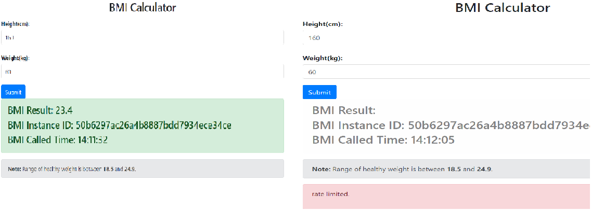

# 流量控制

流量控制机制通过控制数据传输速率来避免微服务过载运行。本指南将展示如何在 *体质指数* 应用中使用 **ServiceComb** 提供的流量控制能力。

## 前言

在您进一步阅读之前，请确保您已阅读了[体质指数微服务应用开发](quick-start-bmi.md)，并已成功运行体质指数微服务。

## 开启

* 在 *体质指数计算器* 的 `pom.xml` 文件中添加依赖项：

```xml
<dependency>
  <groupId>org.apache.servicecomb</groupId>
  <artifactId>handler-flowcontrol-qps</artifactId>
</dependency>
```

* 在 *体质指数计算器* 的 `application.yml` 文件中指明使用流量控制的处理链及指定流控策略：

```yaml
servicecomb:
 handler:
   chain:
     Provider:
       default: qps-flowcontrol-provider
 flowcontrol:
   Provider:
     qps:
       limit:
         gateway: 1
```

也可以通过环境变量的方式动态修改配置文件的值，比如采用以下指令重新运行即可：

```bash
mvn spring-boot:run -Dspring-boot.run.jvmArguments="-Dservicecomb.handler.chain.Provider.default=qps-flowcontrol-provider -Dservicecomb.flowcontrol.Provider.qps.limit.gateway=1"
```

## 验证 

访问 <a>http://localhost:8889</a>，在身高和体重的输入框中输入正数，尝试在1秒内多次点击 *Submit* 按钮，此时就能看到网页由左侧的正常的界面变成了右侧提示由于流控受限而请求被拒的界面。


