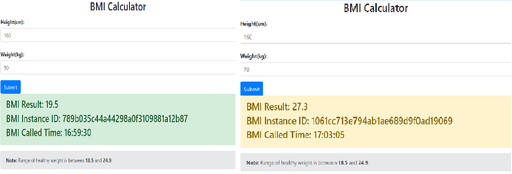

# 灰度发布

灰度发布存在很多不同的应用场景，包括解决版本兼容性问题、A/B Test、平滑升级等。本指南将展示如何在 *体质指数* 应用中使用灰度发布能力。

## 前言

在您进一步阅读之前，请确保您已阅读了[体质指数微服务应用开发](quick-start-bmi.md)，并已成功运行体质指数微服务。

## 启用

* 首先需要进行灰度发布策略设计。 在这个实例中，将体重 >= 60 的请求转发到 0.0.2 版本， 将体重 <60 的请求转发到 0.0.1 版本。 灰度发布策略一般使用请求头进行标记，
  为了实现这个目的，使用 Java Chassis的Context Mapper机制，将符合请求特征的请求设置不一样的 header。 下面的配置会根据请求特性，设置 x-gray = 1， 或者
  x-gray= 0 。 

>>> 注意：流量特征治理的匹配规则都是 String - String 的键值对。使用 yaml 文件配置的时候，如果涉及数字和特殊字符，需要使用引号，否则会解析为其他类型出现错误。

```yaml
servicecomb:
  matchGroup:
    bmi-operation: |
      matches:
        - apiPath:
            exact: "/bmi"
    bmi-operation-heavy: |
      matches:
        - apiPath:
            exact: "/bmi"
          queries:
            weight:
              compare: ">=60"
    bmi-operation-thin: |
      matches:
        - apiPath:
            exact: "/bmi"
          queries:
            weight:
              compare: "<60"
  mapper:
    bmi-operation-heavy: |
      target:
        x-gray: "1"
    bmi-operation-thin: |
      target:
        x-gray: "0"
```

* 在 *体质指数界面* 的 `application.yml` 文件中添加灰度发布策略：

```yaml
servicecomb:
  router:
    type: router
  globalRouteRule: |
    - precedence: 2
      match:
        headers:
          x-gray: 
            exact: "1"
      route:
        - weight: 100
          tags:
            version: 0.0.2
    - precedence: 1
      match:
        headers:
          x-gray: 
            exact: "0"
      route:
        - weight: 100
          tags:
            version: 0.0.1
```

>>> 注意：路由控制是在消费者方。

## 验证

对 *体质指数计算器* 微服务进行水平扩展，使其运行实例数为2，即新增一个运行实例。 该实例的版本号是 0.0.2. 

```bash
mvn spring-boot:run -Dspring-boot.run.jvmArguments="-Dservicecomb.rest.address=0.0.0.0:7779 -Dservicecomb.service.version=0.0.2"
```

* 访问 <a>http://localhost:8889</a> ，在身高和体重栏处输入正数，并点击 *Submit* 按钮。

* 如果体重大于等于60， 请求始终转发到一个0.0.2版本实例；体重小于60， 请求会转发到0.0.1版本的实例。 

  