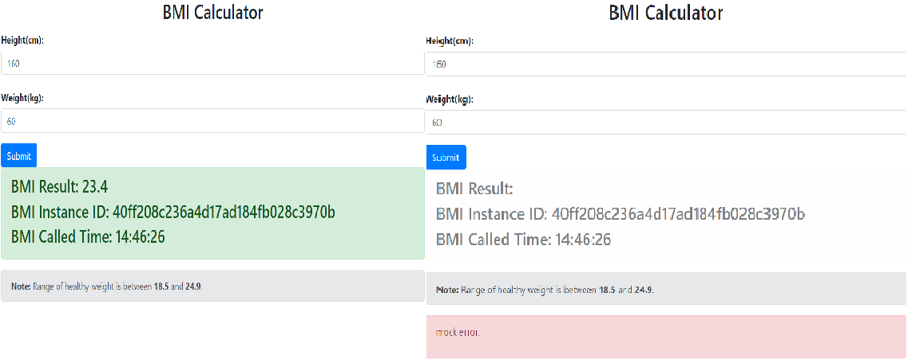

# 熔断控制

熔断控制主要用于解决或缓解服务雪崩的情况，即个别微服务表现异常时，系统能对其进行容错处理。本指南将会展示如何在 *体质指数* 应用中使用熔断控制能力。

## 前言

在您进一步阅读之前，请确保您已阅读了[体质指数微服务应用开发](quick-start-bmi.md)，并已成功运行体质指数微服务。

## 启用

* 在 *体质指数界面* 的 `application.yml` 文件中指明使用服务治理的处理链及指定熔断和容错策略：

```yaml
servicecomb:
  matchGroup:
    bmi-operation: |
      matches:
        - apiPath:
            exact: "/bmi"
  instanceIsolation:
    bmi-operation: |
      minimumNumberOfCalls: 5
      slidingWindowSize: 10
      slidingWindowType: COUNT_BASED
      failureRateThreshold: 50
      slowCallRateThreshold: 100
      slowCallDurationThreshold: 3000
      waitDurationInOpenState: 10000 
      permittedNumberOfCallsInHalfOpenState: 10

```

>>> 注意：熔断控制是在消费者方。

## 验证

对 *体质指数计算器* 微服务进行水平扩展，使其运行实例数为2，即新增一个运行实例：

```bash
mvn spring-boot:run -Dspring-boot.run.jvmArguments="-Dservicecomb.rest.address=0.0.0.0:7779 -Dbmi.mock.error=true"
```

* 访问 <a>http://localhost:8889</a> 。 输出身高和体重，连续点击几次提交，可以看到界面交替出现正常和错误界面。这是因为在其中一个实例里面构造了故障。

  

* 继续点击界面，经过10次以后，发现故障实例被熔断。不再出现错误，所有的请求都被正常实例处理。每间隔10秒，会尝试往故障实例发生若干请求。 

* 验证服务恢复正常。重启故障实例，不注入故障。 可以看到所有的请求都被正常处理，而且请求均匀的分布在两个正常实例。 

