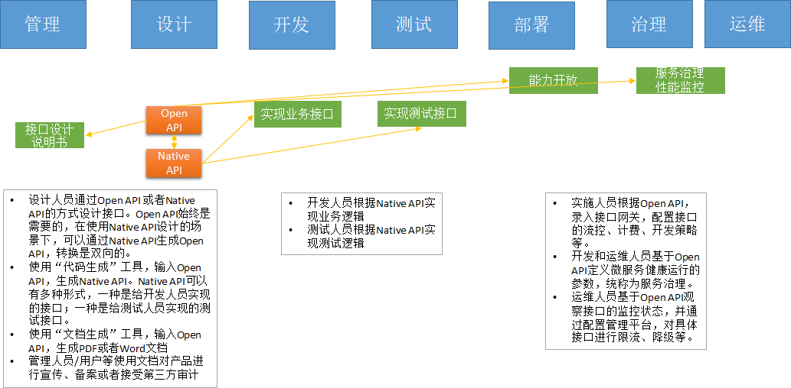

# Java Chassis 3技术解密：契约优先（API First）开发

契约优先（API First）开发是指应用程序开发过程中，将API设计作为第一优先级的任务。契约优先开发随着Web Services概念的发展而不断得到重视，特别是微服务架构出现以后，API设计成为影响功能开放、性能优化等问题的关键因素。常见的契约优先开发框架和模式有如下几种：

* Web Services技术可以由设计人员先编写WSDL描述WEB服务内容，然后结合工具生成代码。WSDL可以进行分发，不同的语言都可以结合WSDL生成客户端。
* gRPC技术可以由设计人员先编写IDL描述RPC服务内容，然后结合工具生成代码。gRPC主要解决服务内部之间的调用。
* Spring Boot允许开发人员利用swagger工具，先编写Open API接口，然后通过工具生成RESTFul的服务端代码。

这些技术都要求设计人员掌握一种语言无关的描述语言（WSDL、IDL、Swagger等），并且通过工具生成具体语言的代码。它们支持的应用场景也有所差异，Web Service适合对外的WEB服务，gRPC适合对内的RPC服务。Java Chassis契约优先开发具备下面的几个改进：

* 允许直接使用Java语言定义服务接口，不需要设计者掌握新的描述语言。
* 同时定义Web服务接口和内部RPC接口。

和Spring Boot一样， Java Chassis的语言无关性描述语言仍然是Open API，通过Open API，可以满足跨语言和服务分发的要求。

## 契约优先开发的过程

契约优先开发可以涵盖设计、开发、测试、部署、运维等软件开发的全流程，通过契约可以实现不同环节的并行工作，从而提高开发效率。 一个简单的契约开发过程如下：



下面通过代码简单展示通过Java语义定义契约，并实现提供者和消费者的过程。

* 定义服务契约

```java
@RequestMapping(path = "/provider")
public interface ProviderService {
  @GetMapping("/sayHello")
  String sayHello(@RequestParam("name") String name);
}
```

* 定义提供者

```java
@RestSchema(schemaId = "ProviderController", schemaInterface = ProviderService.class)
public class ProviderController implements ProviderService {
  @Override
  public String sayHello(String name) {
    return "Hello " + name;
  }
}
```

* 定义消费者

```java
@Configuration
public class ProviderServiceConfiguration {
  @Bean
  public ProviderService providerService() {
    return Invoker.createProxy("provider", "ProviderController", ProviderService.class);
  }
}
```

使用RPC方式访问提供者。

```java
@RestSchema(schemaId = "ConsumerController", schemaInterface = ConsumerService.class)
public class ConsumerController implements ConsumerService {
  private ProviderService providerService;

  @Autowired
  public void setProviderService(ProviderService providerService) {
    this.providerService = providerService;
  }

  @Override
  public String sayHello(String name) {
    return providerService.sayHello(name);
  }
}
```

* 服务分发和Web服务访问

提供者的服务定义会生成如下Open API信息

```yaml
openapi: 3.0.1
info:
  title: swagger definition for org.apache.servicecomb.samples.api.ProviderService
  version: 1.0.0
servers:
- url: /provider
paths:
  /sayHello:
    get:
      operationId: sayHello
      parameters:
      - name: name
        in: query
        required: true
        schema:
          type: string
      responses:
        "200":
          description: response of 200
          content:
            application/json:
              schema:
                type: string
            application/protobuf:
              schema:
                type: string
            text/plain:
              schema:
                type: string
components: {}
```
这个信息可以用于WEB服务访问，比如上面的信息可以使用

```text
GET /providers/sayHello?name=World
```

的HTTP请求来访问。 对于其他框架或者语言，也可以使用Open API生成对应的代码来访问。 

## 服务治理

服务治理被设计为独立于开发过程，结合Open API和服务治理规则描述语言，能够对API进行服务治理配置。

```yaml
servicecomb:
  matchGroup:
    helloOperation: |
      matches:
        - apiPath:
            prefix: "/provider/sayHello"
  rateLimiting:
    ## 限流器每10毫秒允许通过100个请求，如果一个请求超过1000毫秒没有获取到
    ## 许可，将被拒绝
    helloOperation: |
      rate: 100
      limitRefreshPeriod: 10
      timeoutDuration: 1000
```

上述规则对API接口进行限流控制。 

## 契约优先开发的其他方面

测试方面，可以通过契约生成自动化测试代码，以覆盖API的测试。 部署实施方面，可以将Open API信息导入网关，实现API能力开放、认证鉴权、计费等。 此外，契约还可以用于文档生成、应用监控统计等各个方面。

## 总结

Java Chassis基于JAVA语言的接口定义，可以同时满足Native语言和平台无关描述语言两种情况的SDK分发，并且不需要使用工具生成额外的运行代码，给外部服务开发和内部服务开发提供了统一一致的开发体验。 契约优先开发是面向服务化/微服务化非常高效的过程方法，Java Chassis给支持契约优先开发提供了很好的工具支持。 
