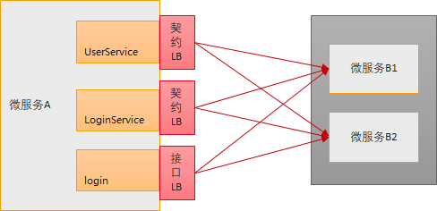

# Java Chassis 3技术解密：接口维度负载均衡

在[Java Chassis 3技术解密：负载均衡选择器](load-balancer.md)中解密了Java Chassis 3负载均衡在解决性能方面提供的算法。这次解密的技术来源于实际客户案例：

> 在客户的微服务系统中，存在很多种不同逻辑的接口，以及特殊的访问模式，经常会出现部分实例线程池排队严重，而其他实例负载不高的负载不均衡现象。比如：微服务A访问微服务B，微服务B存在B1、B2两个实例，OP1、OP2两个接口，其中OP1处理比较耗时，占用较多CPU时间，OP2处理较快。微服务A的业务逻辑会以OP1、OP2、OP1、OP2...这样的访问模式调用微服务B。客户系统会经常出现OP1全部访问B1、OP2全部访问B2的现象。

产生这个问题的原因是Round Robin算法根据请求顺序来分配实例，而未差异化考虑不同请求的均衡要求。解决这个问题最简单直接的思路是使用Random算法，但是在进行负载均衡算法选择的时候，可预期性对于问题定位、问题分析、问题规避等都有非常大的便利，因此Round Robin算法仍然是缺省的最优选择。

Java Chassis 3的解决方案是提供接口维度的负载均衡。



默认场景，Java Chassis为每个契约（Schema）创建一个负载均衡，如果OP1和OP2分别属于UserService和LoginService，那么在上述示例的场景中，开发者不需要做任何配置，流量会自动实现均衡。

如果OP1和OP2都属于LoginService，并且需要保证OP1的流量均衡，可以通过配置：

```properties
servicecomb.loadbalance.${微服务B}.${契约名称}.${接口名称}.strategy.name=RoundRobin
```
比如：

```properties
servicecomb.loadbalance.B.LoginService.login.strategy.name=RoundRobin
```

给耗时请求OP1（login）设置不同的负载均衡。 

## 进一步讨论

从上述负载均衡的原理可以看出，假设微服务X会访问M个微服务，每个微服务平均有N个契约，那么X会创建M * N的负载均衡。对于大多数系统，这个数量级都在1K以内。一般的，只需要对于耗时的接口分配独立的负载均衡，以保证耗时请求的流量均衡。除了解决流量均衡问题，Java Chassis的配置方法，还可以针对其他特殊场景提供非常简洁的配置方案，比如可以通过配置：

```properties
servicecomb.loadbalance.${微服务B}.${契约名称}.${接口名称}.strategy.name=SessionStickiness
```

为具体的接口指定会话粘滞策略。 

## 总结

Java Chassis 3通过接口维度负载均衡的策略设置，为不同的应用场景提供了非常强大的负载均衡管理能力，帮助解决负载不均衡、会话粘滞等应用负载问题。 
