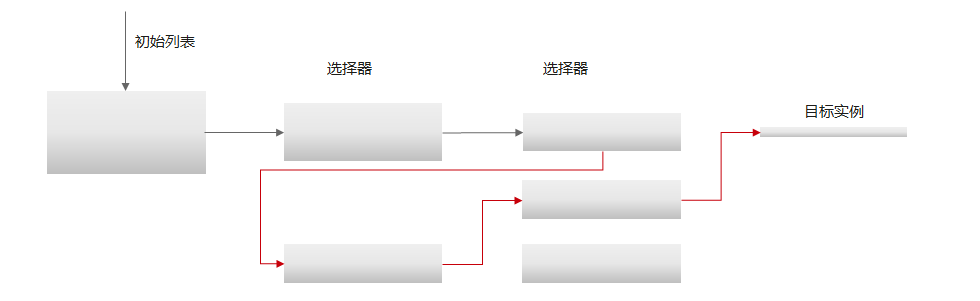

# Java Chassis 3技术解密：负载均衡选择器

负载均衡用于管理微服务实例之间的访问策略。它负责在每次请求中高效选择目标实例，并保持请求在多个目标实例中均衡。目标实例选择过程可以使用下面的示例图简单展示：


AZ亲和是常见的选择器之一。它根据本实例的AZ信息和目标实例的AZ信息，确定合适的目标实例子集，实例子集与本实例具有相同的AZ信息。

负载均衡选择器是一个典型的职责链模式。

* Ribbon 的职责链

```java
public interface ServerListFilter<T extends Server> {
  List<T> getFilteredListOfServers(List<T> servers);
}
```

* Spring Cloud Commons 的职责链

```java
public abstract class DelegatingServiceInstanceListSupplier implements ServiceInstanceListSupplier, InitializingBean, DisposableBean {
  protected final ServiceInstanceListSupplier delegate;

  public DelegatingServiceInstanceListSupplier(ServiceInstanceListSupplier delegate) {
    this.delegate = delegate;
  }

  public ServiceInstanceListSupplier getDelegate() {
    return this.delegate;
  }
}
```

* Java Chassis 的职责链

```java
public interface DiscoveryFilter extends Ordered {
  DiscoveryTreeNode discovery(DiscoveryContext context, DiscoveryTreeNode parent);
}
```

Java Chassis 使用了树型结构的职责链，它的工作过程如下：

* 将实例预分组。
* 通过树型结构索引，快速找到目标实例集合。
* 当某个树节点为空的场景，可以返回上层选择器，重新查找。 

能够快速检索到实例的场景：


出现实例为空的的场景：




相对于线性的职责链模式，树型职责链模式存在两方面明显的优势：

* 计算复杂度从 O(N) 降低为 O(1)。 当实例规模很大，比如超过1000的时候，该算法能够极大的降低CPU使用率，减少垃圾回收的数量。 
* 能够解决上层选择器的结果在下层选择器的结果为空的问题。比如在AZ亲和场景，如果本AZ的实例不满足后续选择器的条件，那么使用非本AZ的实例，能够确保本次访问的正确性，降低错误率，也能够更好的满足请求均衡的要求。

>>> 客户故事：在某个客户的实际场景中，如果实例数超过1000，负载均衡的CPU消耗占到整个请求处理时间的20%以上，随着应用规模的变大，负载均衡处理算法的性能优化变得更加重要了。 
