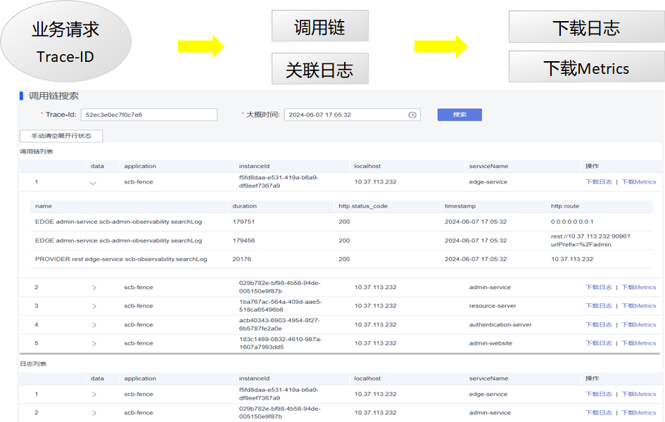

# Java Chassis 3技术解密：实用的可观测性

狭义的可观测性，指日志、调用链和指标，广义的可观测性则包含更多的内容，一般的，应用程序暴露出来的便于理解其运行状态、运行轨迹、内部结构和功能集合的信息，都是可观测性的范围，本文只讨论狭义的可观测性。日志揭露了应用程序内部运行的轨迹，通过异常日志，可以理解错误产生的原因；调用链反映的是一次业务操作经过的关键处理节点，可以帮助快速确定问题发生的边界；指标反映错误发生时应用程序的当前或者历史状态，帮助分析需要一定的时间或者流量积累才会发生的问题，比如过载问题、性能问题等。可以看出，为了分析故障，具备可观测性能力非常重要。

微服务系统具备复杂的调用关系和分布式部署特征，为了更好的分析和处理日志、调用链和指标，通常会部署ELK、SkyWalking和Prometheus等外部系统。 这些系统完全搭建起来，会花费数十万每年的计算成本，而且很可能并没有显著提升日常问题定位的效率，不恰当的使用还可能会引入性能问题。针对问题定位难的情况，Java Chassis 3提供了非常简单高效，而且低成本的解决方案。由于采集的数据，都是和Java Chassis运行过程和系统架构强相关的，也避免了采集海量无关数据，使得数据对于问题分析更具有针对性，能够更加快速识别问题根因。

在下面的部分，我们首先解密如何使用可观测能力来快速定位问题，然后再解密这个能力是如何构建起来的。 

## 问题定位流程

在很多组织里面，问题定位都是由不太熟悉系统结构和技术细节的运维人员开始的，或者是由工作交接后刚刚接触系统的新人开始的，这给快速定界问题，收集和问题相关的信息带来了巨大的挑战。一个问题从发现到传递给责任模块，数个小时的时间就过去了。 设计一个简单的问题定位流程，快速定界问题和收集关联信息，是可观测系统搭建的起点。

当用户识别到一个故障，比如交易失败，在系统层面，会对应到一次系统请求的失败。在系统设计之初，会采用一个请求标识将用户故障和系统请求关联起来，即 `TraceId`， 这个是所有调用链系统设计的基础。 通常建议前端在发送请求的时候，都携带 `TraceId`， 便于将前后端请求进行关联。在前端未按照要求携带 `TraceId` 的情况下，Java Chassis会在应用网关 Edge Service生成 `TraceId`， 并在给前端响应的HTTP头中携带 `TraceId`。 当用户识别到一个故障，可以通过浏览器等前端工具获取到 `TraceId`。 问题定位的起点是获取`TraceId`。



在管理控制台，输入`TraceId` 和问题发生大概时间，可以检索出关键的调用链信息和关键日志信息。 通过调用链信息，可以知道请求的执行轨迹和发生问题的节点，通过关键日志信息，能够快速确定问题根因。 对于一些简单常见的问题，经过这个简单的步骤，就能够确定问题根因。 

对于一些复杂的问题，需要获取上下文日志或者指标来进行深入的分析，运维人员可以在检索结果里面将完整的日志文件和指标信息下载下来，提供给故障服务的技术人员。 

从上面的过程可以看出，运维人员在不理解系统实现细节的情况下，也能快速定界和定位一些简单问题，并能够快速收集详细的和问题强相关的信息提供给技术人员做进一步处理。 

## 实现原理

Java Chassis在设计之初，就内置了大量的可观测能力。使用上述流程，无需部署ELK、SkyWalking和Prometheus去采集数据，也不需要集成这些工具的SDK或者Agent。 通过一些开发规范约束和`可观测API`就能够实现一个简单高效和易用的定位系统。

> 动手试试： 可以通过下载和运行 [fence](https://github.com/apache/servicecomb-fence) 项目，体验上述问题定位流程和了解本章节介绍的实现原理。 也可以在实际的业务系统中，参考该项目构筑业务需要的可观测能力。 

Java Chassis通过集成[应用性能监控](../../general-development/metrics.md)、[微服务调用链](../../general-development/microservice-invocation-chain.md)来生成调用链和指标，日志则使用 `slf4j` 来记录。 这些数据构成了可观测的基础， 接下来就是如何存储和采集这些数据。 

通过配置 `log4j2` , 可以将日志、调用链和指标都输出到日志文件。 特别的，该日志配置约束了数据存储的规则、路径，为`可观测API`提供了简单的实现方案。 

```xml
<Configuration>
    <Properties>
        <property name="FILE_PATH" value="./logs/admin-website"/>
    </Properties>

    <Appenders>
        <Console name="Console" target="SYSTEM_OUT">
            <PatternLayout pattern="%-d{yyyy-MM-dd HH:mm:ss} [%X{SERVICECOMB_TRACE_ID}][%p][%t][%c:%L] %m%n"/>
        </Console>

        <RollingFile name="RootLog" fileName="${FILE_PATH}/root.log"
          filePattern="${FILE_PATH}/root-%d{yyyy-MM-dd-HH}.log">
            <PatternLayout pattern="%-d{yyyy-MM-dd-HH:mm:ss} [%X{SERVICECOMB_TRACE_ID}][%p][%t][%c:%L] %m%n"/>
            <Policies>
                <TimeBasedTriggeringPolicy interval="3"/>
            </Policies>
            <DefaultRolloverStrategy max="100"/>
        </RollingFile>

        <RollingFile name="TraceLog" fileName="${FILE_PATH}/trace.log"
          filePattern="${FILE_PATH}/trace-%d{yyyy-MM-dd-HH}.log">
            <PatternLayout pattern="%-d{yyyy-MM-dd HH:mm:ss} %m%n"/>
            <Policies>
                <TimeBasedTriggeringPolicy interval="3"/>
            </Policies>
            <DefaultRolloverStrategy max="100"/>
        </RollingFile>

        <RollingFile name="MetricsLog" fileName="${FILE_PATH}/metrics.log"
          filePattern="${FILE_PATH}/metrics-%d{yyyy-MM-dd-HH}.log">
            <PatternLayout pattern="%-d{yyyy-MM-dd HH:mm:ss} %m%n"/>
            <Policies>
                <TimeBasedTriggeringPolicy interval="3"/>
            </Policies>
            <DefaultRolloverStrategy max="100"/>
        </RollingFile>
    </Appenders>

    <Loggers>
        <Logger name="scb-trace" level="INFO" additivity="false">
            <AppenderRef ref="TraceLog"/>
        </Logger>
        <Logger name="scb-metrics" level="INFO" additivity="false">
            <AppenderRef ref="MetricsLog"/>
        </Logger>

        <Root level="INFO">
            <AppenderRef ref="Console"/>
            <AppenderRef ref="RootLog"/>
        </Root>
    </Loggers>
</Configuration>
```

每个微服务都集成和实现`可观测API`。 

```java
@Path("/v1/scb/observability")
public interface ObservabilityService {
  String NAME = "scb-observability";

  @Path("/searchTrace")
  @GET
  SearchTraceResponse searchTrace(@NotNull @QueryParam("timestamp") String timestamp,
      @NotNull @QueryParam("traceId") String traceId);

  @Path("/searchLog")
  @GET
  SearchLogResponse searchLog(@NotNull @QueryParam("timestamp") String timestamp,
      @NotNull @QueryParam("traceId") String traceId);

  @Path("/downloadLog")
  @GET
  Part downloadLog(@NotNull @QueryParam("timestamp") String timestamp);

  @Path("/downloadMetrics")
  @GET
  Part downloadMetrics(@NotNull @QueryParam("timestamp") String timestamp);
}
```

最后，我们可以开发一个管理控制服务，实现`管理面可观测API`， 就完成了可观测能力的构建：

```java
@Path("/v1/scb/admin/observability")
public interface AdminObservabilityService {
  String NAME = "scb-admin-observability";

  @Path("/searchTrace")
  @GET
  List<SearchTraceResponse> searchTrace(@NotNull @QueryParam("timestamp") String timestamp,
      @NotNull @QueryParam("traceId") String traceId);

  @Path("/searchLog")
  @GET
  List<SearchLogResponse> searchLog(@NotNull @QueryParam("timestamp") String timestamp,
      @NotNull @QueryParam("traceId") String traceId);

  @Path("/downloadLog")
  @GET
  Part downloadLog(@NotNull @QueryParam("timestamp") String timestamp,
      @NotNull @QueryParam("serviceName") String serviceName,
      @NotNull @QueryParam("instanceId") String instanceId);

  @Path("/downloadMetrics")
  @GET
  Part downloadMetrics(@NotNull @QueryParam("timestamp") String timestamp,
      @NotNull @QueryParam("serviceName") String serviceName,
      @NotNull @QueryParam("instanceId") String instanceId);
}
```

## 和传统方案的对比分析

与部署ELK、SkyWalking和Prometheus去采集数据的传统方案对比，上述方案非常简单和实用，能够帮助实时在线分析问题，该方案也无需将日志、调用链和指标等数据集中存储下来，可以节省大量的存储设备空间。 当然它的缺点也是显而易见的，对于已经下线的服务，或者对于历史问题需要追溯的情况，则采集不到相关的信息。 站在问题定位的角度，存储海量的日志、调用链和指标数据，大量数据都是和问题无关的，并且多数情况是要在第一时间完成问题定界和信息收集，因此上述方案相比于传统方案就有了非常大的竞争力优势。 

> 客户故事：很多客户花了大量成本构建可观测能力，依然无法指导运维人员快速定界和定位问题。通过建立一个简单实用的问题定界流程和采集数据的手段，可以帮助提升问题定位效率。 

