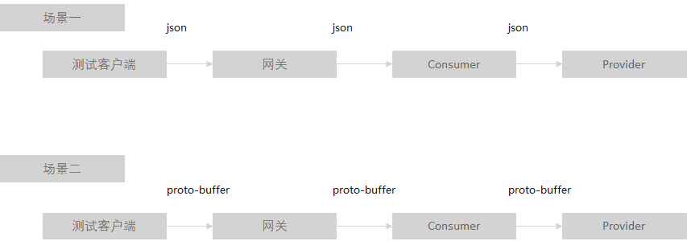

# Java Chassis 3技术解密：多种序列化方式支持

打开一个简单的 `REST` 接口：

```java
@RestSchema(schemaId = "ProviderController")
@RequestMapping(path = "/")
public class ProviderController {
  @PostMapping("/benchmark")
  public DataModel sayHello(@RequestHeader("wait") int wait, @RequestBody DataModel dataModel) {
    if (wait > 0) {
      Thread.sleep(wait);
    }
    return dataModel;
  }
}
```

的`契约`:

```yaml
openapi: 3.0.1
info:
  title: swagger definition for org.apache.servicecomb.samples.ProviderController
  version: 1.0.0
servers:
- url: /
paths:
  /benchmark:
    post:
      operationId: sayHello
      parameters:
      - name: wait
        in: header
        required: true
        schema:
          type: integer
          format: int32
      requestBody:
        content:
          application/json:
            schema:
              $ref: '#/components/schemas/DataModel'
          application/protobuf:
            schema:
              $ref: '#/components/schemas/DataModel'
          text/plain:
            schema:
              $ref: '#/components/schemas/DataModel'
        required: true
        x-name: dataModel
      responses:
        "200":
          description: response of 200
          content:
            application/json:
              schema:
                $ref: '#/components/schemas/DataModel'
            application/protobuf:
              schema:
                $ref: '#/components/schemas/DataModel'
            text/plain:
              schema:
                $ref: '#/components/schemas/DataModel'
components:
  schemas:
    ChildDataModel:
      type: object
      properties:
        numInt:
          type: integer
          format: int32
        numLong:
          type: integer
          format: int64
        numDouble:
          type: number
          format: double
        numFloat:
          type: number
          format: float
        data:
          type: string
      x-java-class: org.apache.servicecomb.samples.ChildDataModel
    DataModel:
      type: object
      properties:
        data:
          type: object
          additionalProperties:
            $ref: '#/components/schemas/ChildDataModel'
      x-java-class: org.apache.servicecomb.samples.DataModel
```

可以看到 Java Chassis使用了Open API 3.0.1的协议规范，`Request Body` 和 `responses` 增加了 `application/protobuf` 、 `text/plain` 的支持。 这种使用形式，奠定了Java Chassis 3多序列化支持方式的基础，细心的读者应该很快能够发现这种方式与其他支持多序列化框架之间的差异。 

* Spring Boot

支持多序列化方式，需要实现 `HttpMessageConverter` 接口，并在 `Controller` 声明支持的 `Content-Type`。 如果使用 `Spring Fox` 或者 `Spring Doc` 等 Open API工具生成契约，契约内容只会包含 `Controller` 声明的序列化类型。 Spring Boot存在隐式的契约情况，这意味着契约并不能完全代表 `Controller` 服务的能力。 如果需要对接口增加或者减少序列化支持，都需要修改代码。 

* Dubbo

Dubbo 需要在 Provider 使用 `dubbo:protocol` 声明序列化方式，  在Consumer使用 `dubbo:reference`  声明序列化方式。 由于 Dubbo 是基于`IDL`的契约系统， 在使用 RPC 的场景下，可以通过配置动态调整序列化方式。 `REST` 支持在 Dubbo 是完全独立的单元， 序列化方式也独立于 RPC 接口， `RPC` 和 `REST` 不能互操作。 

Open API基于 `REST` 的语义，来支持 `IDL` 的语义。 Java Chassis能够更加直观的支持通过第三方工具以HTTP协议族访问微服务， 只需要按照契约的描述构造HTTP的报文。 在编码侧， Java Chassis的客户端可以使用 REST 语义的接口，如 `RestOperations`，也可以使用 RPC 语义的接口访问服务端。 

定义服务端接口：
```java
public interface ProviderService {
  DataModel sayHello(int wait, DataModel dataModel);
}
```

通过RPC访问：
```java
@RestSchema(schemaId = "ConsumerController")
@RequestMapping(path = "/")
public class ConsumerController {
  @RpcReference(schemaId = "ProviderController", microserviceName = "provider")
  private ProviderService providerService;

  @PostMapping("/benchmark")
  public DataModel sayHello(@RequestHeader("wait") int wait, @RequestBody DataModel dataModel) {
    return providerService.sayHello(wait, dataModel);
  }
}
```

Java Chassis以OpenAPI为基础的Edge Service部件，能够实现请求在通信协议、序列化方式上的自动转换。比如将HTTP协议转Highway协议、application/json转application/protobuf等。 

基于 [Java Chassis Benchmark](https://github.com/apache/servicecomb-samples/tree/master/java-chassis-benchmark) ，做一个简单性能测试。该测试对比了两种场景：



场景一的默认配置：

```yaml
servicecomb:
  rest:
    parameter:
      default-request-encoding: "application/json"
      default-response-encoding: "application/json"
```

场景二的默认配置：

```yaml
servicecomb:
  rest:
    parameter:
      default-request-encoding: "application/protobuf"
      default-response-encoding: "application/protobuf"
```

测试结果参考下表。该数据主要用于说明序列化差异，因此省去了测试环境的描述。下表的平均时延统计了测试客户端计算的请求-响应时间的平均值。 

| 版本          | 数据单位 | 等待时间 | 线程数 | 执行次数 | 执行时间   | 平均时延 |
|-------------|------|------|-----|------|--------|------|
| protobuffer | 1    | 0    | 10  | 1000 | 6642   | 6    |
| protobuffer | 100  | 0    | 10  | 1000 | 9418   | 9    |
| protobuffer | 1000 | 0    | 10  | 1000 | 25205  | 24   |
| protobuffer | 1    | 10   | 10  | 1000 | 15432  | 15   |
| protobuffer | 100  | 10   | 10  | 1000 | 15965  | 15   |
| protobuffer | 1000 | 10   | 10  | 1000 | 25926  | 25   |
| protobuffer | 1    | 100  | 10  | 1000 | 105727 | 105  |
| protobuffer | 100  | 100  | 10  | 1000 | 106376 | 106  |
| protobuffer | 1000 | 100  | 10  | 1000 | 114452 | 114  |
| jason       | 1    | 0    | 10  | 1000 | 6736   | 6    |
| jason       | 100  | 0    | 10  | 1000 | 15063  | 14   |
| jason       | 1000 | 0    | 10  | 1000 | 69757  | 68   |
| jason       | 1    | 10   | 10  | 1000 | 16632  | 16   |
| jason       | 100  | 10   | 10  | 1000 | 20033  | 19   |
| jason       | 1000 | 10   | 10  | 1000 | 66104  | 65   |
| jason       | 1    | 100  | 10  | 1000 | 104868 | 104  |
| jason       | 100  | 100  | 10  | 1000 | 107439 | 107  |
| jason       | 1000 | 100  | 10  | 1000 | 132786 | 131  |

从这组数据可以看出：

* 在数据量比较小的场景下，使用 `json` 和 `proto-buffer` 性能差异很小。 在数据量比较大的情况下，`proto-buffer` 的性能明显好于 `json`。 
* 在业务时延比较大（>100ms）的时候， 序列化的时延可以忽略。 

不同的序列化方式除了性能差异，在可维护方面也会存在很大的差异。比如 `proto-buffer` 在兼容性方面的表现会比 `json` 差，当修改接口定义的时候， 比如增加属性、删除属性、修改属性等，`proto-buffer` 更容易导致兼容性问题，做好兼容性防范对多数用户而言，都是比较困难的事情。 

支持多协议、多序列化方式的另外一个考虑，是对接遗留系统。对接遗留系统会背负大量历史债务，使得新系统本身设计偏离预期的方向。在 Java Chassis 多序列化方式的选择上， 只提供了目前广泛使用的 `json` 和 `proto-buffer` 支持， 而没有选择支持其他序列化方案。 以架构的韧性去处理遗留系统问题，是 Java Chassis坚持的一个重要设计理念，对接遗留系统或者保持与遗留系统的兼容，不是它的主要设计目标。 


在序列化方式选择上，简单的总结如下：

* 使用 `REST` 协议是绝大多数场景的最优选择，能够最好的兼顾性能、可靠性、韧性等方面的要求。
* 对于数据量比较大，业务时延很低(<100ms)，并且业务比较稳定，业务接口不需要频繁变动的场景，可以采用 `proto-buffer`来优化性能，按需调整。

>>> 客户故事：某个客户的关键核心系统对于时延要求很高，因此需要采用私有协议和序列化方式来提升性能。但是对于一些非核心系统，需要使用REST接口，方便日常开发、调试。Java Chassis的解耦设计使得客户无需对代码进行任何改造，就可以满足两方面的要求。
