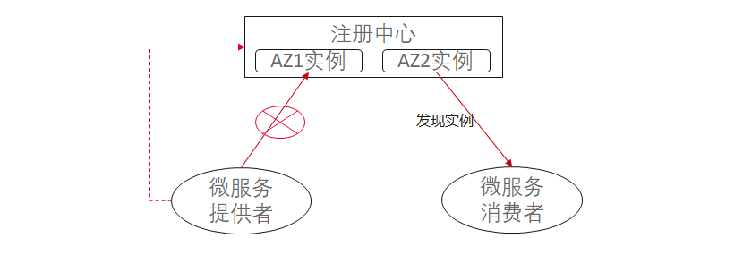
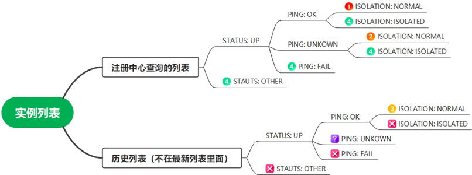
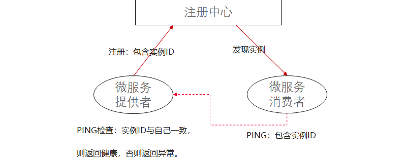

# Java Chassis 3技术解密：注册中心分区隔离

注册中心负责实例的注册和发现，对微服务可靠运行起到举足轻重的作用。实例变更感知周期是注册中心最重要的技术指标之一。感知周期代表提供者的实例注册或者下线后，消费者感知实例注册或者下线的周期。影响实例变更感知周期的技术因素有很多。

* 数据一致性。一致性指实例在注册中心的一个节点注册，从注册中心的不同节点能否同时读取到实例的注册信息。这个技术因素对于实例变更感知周期有一定影响，比如最终一致性的感知速度会慢，强一致性的感知速度会快。但多数场景，这个技术指标不是核心因素。
* 变更通知机制。变更通知机制指消费者获取最新实例列表的方式，通常有几种方式：定期Pull的方式，消费者周期性的从注册中心查询实例列表；注册中心Push的方式，注册中心通过长连接、WebSocket等协议，将实例变化通知消费者。定期Pull的方式感知周期相对较长，工作机制比较可靠，容错效率高，对于网络要求低，更加安全；注册中心Push的方式感知周期很短，容易出现事件错乱或者堆积，对于网络规划有一定要求。
* 注册中心检测实例状态的方式。注册中心检测实例状态的方式表示如何判断实例的状态是正常还是异常。比如Service Center需要实例定期的发送心跳，如果在3个心跳周期未检测到心跳，那么认为实例异常；比如Nacos则根据微服务实例与注册中心的长连接状态判断实例是否异常。

此外，实例管理规模、支持元数据管理等也是注册注册中心比较常见的功能特性。比如Java Chassis 2要求注册中心必须支持契约的注册和管理。

Java Chassis 3的设计目标之一，就是降低对于注册中心功能的依赖，能够支持尽可能多的注册中心，而不降低微服务自身的可靠性。 在描述 Java Chassis 3的实例管理机制之前，先讨论一个典型的问题：注册中心分区隔离。

注册中心分区隔离是指如下场景：



微服务提供者与注册中心之间的网络发生故障，而服务消费者与注册中心之间的网络是正常的，即产生分区隔离。在发生分区隔离的场景下，现有的保活机制都会认为微服务提供者下线，进而导致微服务消费者访问微服务提供者出现大规模失败。分区隔离通常会发生在注册中心在多AZ部署/容灾的场景，微服务提供者和微服务消费者连接的是不同AZ的注册中心实例。在微服务提供者和消费者跨AZ部署的时候，也可能发生。

注册中心分区隔离故障会造成大面积的应用调用失败，是注册中心有关故障中，最严重的故障之一。

* Ribbon的解决方案

Ribbon在客户端提供了 `IPing` 接口来检测实例故障，以检测注册中心错误下线实例，而实例实际可以工作的场景。 该机制在多数场景工作良好，然而在容器场景下，可能长期保留错误的实例。因为微服务提供者不是由于分区隔离错误，而是重启的场景下，如果原来的端口被其他服务占用，则会导致微服务消费者始终保留错误的实例。

```java
public interface IPing {
    boolean isAlive(Server server);
}
```

* Spring Cloud的解决方案

Spring Cloud的机制和Ribbon类似，提供了 `HealthCheckServiceInstanceListSupplier` ，并允许开发者定义实例监控状态检测方式。 

* Java Chassis的解决方案

Java Chassis结合实例是否在注册中心查询到(History)、实例状态(Status)、Ping状态(Ping)、隔离状态（Isolation）将实例分组，并给不同的组分配不同的优先级。 



在 `Java Chassis 3技术解密：负载均衡选择器` 中，解密了Java Chassis分组实例使用的机制。当出现注册中心分区隔离的情况，实例在注册中心查询不到，仍然被保留到了 `History` 分组，只要实例 Ping 状态正常， 这个实例仍然会被使用， 从而防止了实例被错误下线。 

Java Chassis还设计了新的Ping机制，解决容器场景下，可能长期保留错误的实例的问题。 Ping机制的核心逻辑包含如下几个部分：

* 微服务提供者向注册中心注册的时候，生成实例ID。实例ID需要保证进程的每次重启，都是唯一的。
* 微服务消费者通过PING消息检测微服务提供者的存活状态。PING消息包含微服务提供者的实例ID。
* 微服务提供者检测PING消息里面的实例ID，如果实例ID与自己的实例ID相同，则返回健康，否则返回异常。



Java Chassis提供了新的健康检查接口：

```java
@RestSchema(schemaId = ManagementEndpoint.NAME, schemaInterface = ManagementEndpoint.class)
public class ManagementEndpointImpl implements ManagementEndpoint {
  private RegistrationManager registrationManager;

  @Autowired
  public void setRegistrationManager(RegistrationManager registrationManager) {
    this.registrationManager = registrationManager;
  }
  
  @Override
  public boolean health(String instanceId, String registryName) {
    String mySelf = registrationManager.getInstanceId(registryName);
    if (StringUtils.isEmpty(mySelf)) {
      return false;
    }
    return mySelf.equals(instanceId);
  }
}
```

Java Chassis 2结合Service Center的功能设计，共同保障了注册发现的可靠性。Java Chassis 3通过应用客户端技术，降低了对于注册中心的依赖，使得 Java Chassis 3使用不同的注册中心都能够取得很高的可靠性。 内置的实例状态分组管理和创新的Ping机制设计，使得 Java Chassis 3在注册中心分区隔离故障条件下也能稳定的工作。 

>>> 客户故事：注册中心推空故障是 `Nacos` 的经典故障，对于系统可靠性运行产生了非常大的影响。推空故障的影响机制和分区隔离故障的影响机制类似。借助于Java Chassis 3，能够将业务影响的时间和范围降到最低。
