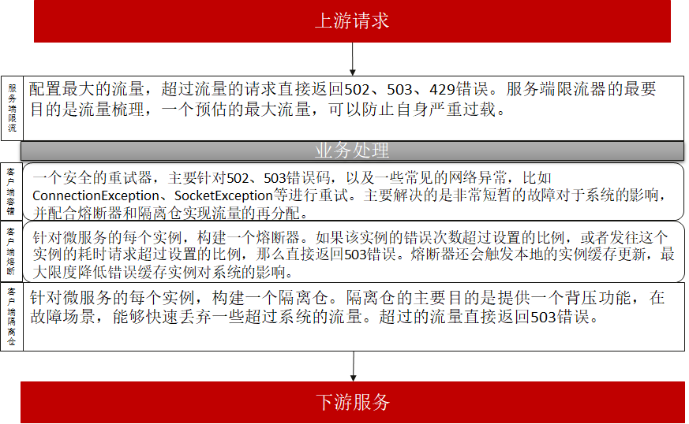

# 快速失败和重试

随机失败在微服务系统经常发生。产生随机失败的原因非常多，以JAVA微服务应用为例，造成请求超时这种随机失败的原因包括：网络波动和软硬件
升级，可能造成随机的几秒中断；JVM垃圾回收、线程调度导致的时延增加；流量并不是均匀的，同时到来的1000个请求和1秒内平均来的1000个请求
对系统的冲击是不同的，前者更容易导致超时；应用程序、系统、网络的综合影响，一个应用程序突然的大流量可能会对带宽产生影响，从而影响其他
应用程序运行；其他应用程序相关的场景，比如SSL需要获取操作系统熵，如果熵值过低，会有几秒的延迟。系统不可避免的面临随机故障，必须具备
一定的随机故障保护能力。

重试是解决随机失败的一个非常有效的措施。但是实施重试是一个非常复杂的课题。本文提供一个重试的最佳架构方案，分析如何解决重试面临的处理
快速失败的问题。 

使用`请求超时`配置来控制快速失败是非常常见的手段，因为它简洁无侵入，适用于大多数对于性能要求不高的场景。但是对于大规模应用系统，以及
对于请求时延要求非常高的系统，`请求超时`并不是快速失败的有效手段，有如下原因：

* 请求超时在使用HTTP协议的情况下，会关闭连接。连接重连是非常耗时的操作，大量重连会导致系统性能的严重恶化。
* 在多线程系统，请求超时都是通过独立的线程进行检测的。这里涉及一个实时计算的问题。JDK并不能很好的应用于实时计算。简单的讲就是超时
  检查并不是准确的。当系统繁忙的时候，超时的检测准确性会持续下降，本来一些正常处理未超时的请求，可能被误认为超时；一些超时的请求，
  可能推迟了一段时间才检测到。 应用程序应该减少实时性假设，包括：client实时感知实例上下线；超时时间很精确；任务按照预期的执行
  时间处理；任务的处理时间恒定等。 从可靠性的角度，用户配置的超时时间不应该很短，从经验上来讲，超时时间配置小于1s的情况，系统发生
  超时失败的概率会显著提升。如果业务的平均时延10ms数量级，建议超时时间配置不应该低于1s，平均时延越高，超时时间应该等比例增加。
* 超时以后，请求返回，并不会中断已经进行的任务。强制中断进行的任务（比如终止线程的方式），会破坏程序内部状态，导致非常复杂难于分析
  的故障，正在执行的任务需要优雅可控制的结束。

## 如何应用重试和快速失败

* 重试的最佳发起方是直接的消费者，比如对于WEB浏览器、手机APP等前端应用。
* 如果前端应用无法重试，在网关进行重试一般是比较推荐的做法，除了重试，网关还需要加入流量控制和流量梳理功能，过滤超出系统处理能力的流量，并将突发的流量
  转换为平滑的流量。
* 微服务系统内部的请求进行重试可以作为补充，建议限制重试次数为2，超时等错误场景，重试可能带来性能恶化。
* 当业务的平均时延在1ms~10ms，建议超时时间配置不小于1s；10~100ms，超时时间配置不小于5s；大于100ms，超时时间配置不小于10s。
  不建议超时时间超过30s（缺省值）。当业务某些请求需要超过30s的时候，应该对这些业务逻辑进行特殊处理，比如修改为独立线程池执行，
  并设置独立的超时时间；或者修改为异步执行，请求来的时候立即返回，通过异步的方式查询任务执行结果。

Java Chassis建议在应用中搭配使用提供者流控和消费者隔离仓，来实现快速失败和重试。 下面是一个微服务的典型治理结构：



该治理结构对应的配置为:

```yaml
## 服务治理配置
servicecomb:
  matchGroup:
    allOperation: 
      matches:
        - apiPath:
            prefix: "/"
  rateLimiting:
  ## 限流器每10毫秒允许通过100个请求，如果一个请求超过1000毫秒没有获取到
  ## 许可，将被拒绝
    allOperation: |
      rate: 10
      limitRefreshPeriod: 1
      timeoutDuration: 1000
  retry:
  ## 重试器最多重试2次，并且尽可能选择不同于失败的实例进行重试。
    allOperation: |
      maxAttempts: 2
      retryOnSame: 0
  instanceIsolation:
  ## 熔断器错误率达到50%或者耗时请求达到100%，将开启。
  ## 开启时间为5000毫秒，然后会放通10个请求。
    allOperation: |
      minimumNumberOfCalls: 10
      slidingWindowSize: 100
      slidingWindowType: COUNT_BASED
      failureRateThreshold: 50
      slowCallRateThreshold: 50
      slowCallDurationThreshold: 5000
      waitDurationInOpenState: 5000
      permittedNumberOfCallsInHalfOpenState: 10
  instanceBulkhead:
  ## 隔离仓限制正在处理的请求数为20个，新来的请求等待1000毫秒没有获取到
  ## 许可，将被拒绝。
    allOperation: |
      maxConcurrentCalls: 20
      maxWaitDuration: 1000
```
