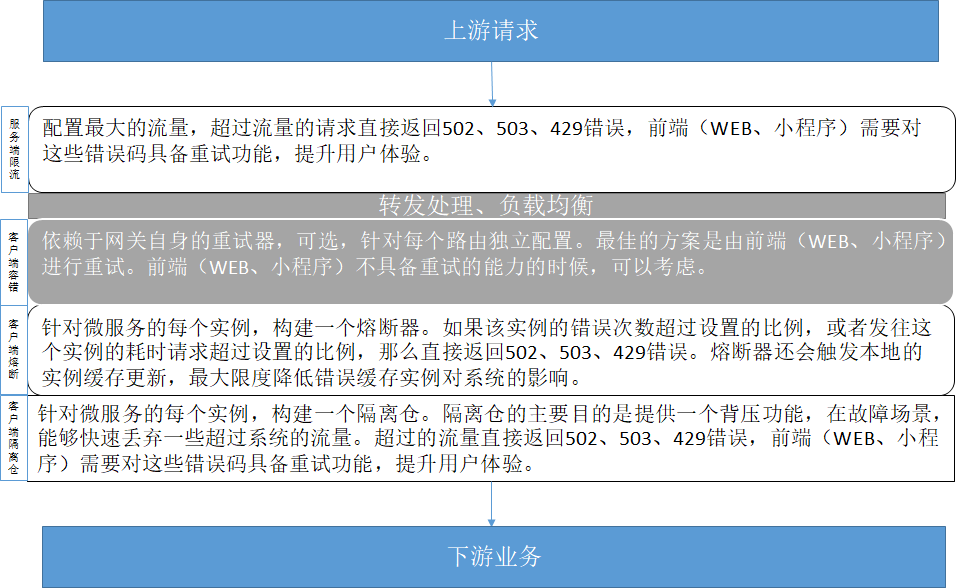
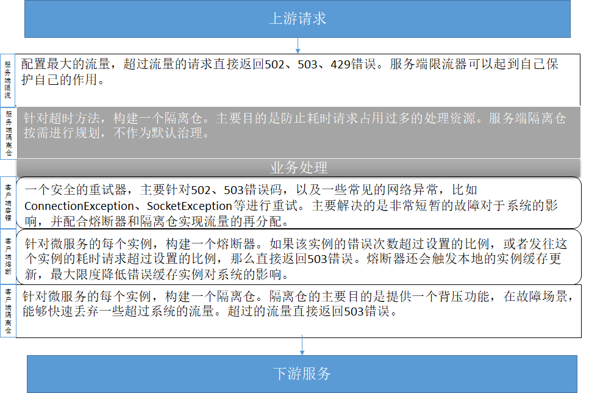

# 流量特征治理最佳实践

在[Java Chassis设计参考](../start/design.md)中总结了典型的微服务应用架构：


参考这个架构，微服务系统有两个比较重要的微服务部件：应用网关和微服务。 这两个部件是微服务治理的重点对象，它们所处的位置和作用存在一些差异，因此应用服务治理的策略也会有所不同。 本文以这个两个部件说明常见的治理策略设计。 

首先，对应系统的所有API访问，做一个全局的业务定义。 

```yaml
servicecomb:
  matchGroup:
    allOperation: |
      matches:
        - apiPath:
            prefix: "/"
```

## 应用网关治理设计

应用网关需要根据系统能够处理的最大流量，配置限流器，快速拒绝超过系统的流量，由用户（前端脚本）发起重试，在保证系统可用性的同时，尽可能降低对于用户体验的影响。还需要提供一定的基于背压的服务治理能力，比如如果后端服务某个实例不可用，或者某个服务刚刚启动完毕，需要初始化，发往这些服务的请求会表现为时延增加，如果不根据时延增加的反馈进行流量控制，就会导致用户体验极速下降。



应用网关配置限流器、熔断器和隔离仓。

* 服务端限流器：超过系统最大处理能力的请求场景，限流值的依据是压测的真实能力数据，可以控制在最大处理能力的80%左右。在系统上线初始阶段，默认设置全局限流器。在无法估算限流大小的时候，可以将流量限制设置为一个最大值，限流器也可以起到流量梳理平滑流量的作用。
* 客户端熔断器：主要解决实例异常下线，本地缓存感知不及时的问题。实例熔断后会触发实例查询。因此，应用网关的熔断器的隔离时间会设置的比较短。
* 客户端隔离仓：主要解决故障场景，比如数据库故障恢复、实例重启等，系统吞吐量下降的情况；或者微服务第一次启动、微服务长期没有请求突然进来大量请求的场景，这些场景可以限制并发连接，避免造成微服务和网关CPU大量使用，请求超时。
* 应用网关可选客户端容错配置。最佳的方案是由小程序、WEB端应用发起重试，进行客户端容错。 

### 配置

```yaml
servicecomb:
  matchGroup:
    allOperation: |
      matches:
       - apiPath:
           prefix: "/"
  rateLimiting:
  ## 限流器每10毫秒允许通过100个请求，如果一个请求超过1000毫秒没有获取到
  ## 许可，将被拒绝
    allOperation: |
      rate: 100
      limitRefreshPeriod: 10
      timeoutDuration: 1000
  instanceIsolation:
  ## 熔断器错误率达到50%或者耗时请求达到100%，将开启。
  ## 开启时间为5000毫秒，然后会放通10个请求。
    allOperation: |
      minimumNumberOfCalls: 10
      slidingWindowSize: 20
      slidingWindowType: COUNT_BASED
      failureRateThreshold: 50
      slowCallRateThreshold: 100
      slowCallDurationThreshold: 1000
      waitDurationInOpenState: 5000
      permittedNumberOfCallsInHalfOpenState: 10
  instanceBulkhead:
  ## 隔离仓限制正在处理的请求数为20个，新来的请求等待1000毫秒没有获取到
  ## 许可，将被拒绝。
    allOperation: |
      maxConcurrentCalls: 20
      maxWaitDuration: 1000
```

### 持续演进
场景一：耗时请求需要配置独立的限流策略。需要结合业务的持续演进，进行配置增加。

```yaml
servicecomb:
  matchGroup:
    timeConsumingOperation: |
      matches:
        - apiPath:
            prefix: "/timeConsumingOperation"
  rateLimiting:
  ## 限流器每100毫秒允许通过1个请求，如果一个请求超过1000毫秒没有获取到
  ## 许可，将被拒绝
  timeConsumingOperation: |
      rate: 1
      limitRefreshPeriod: 100
      timeoutDuration: 1000
```

场景二：需要防止机器人的场景，或者需要防止DDOS的场景，需要先考虑应用网关的扩容，然后根据用户ID或者请求端IP进行分布式限流。应用系统在规划的时候，需要考虑将用户ID通过HTTP HEADER的方式传递；或者ELB需要将客户的IP通过x-real-ip HTTP HEADER传递。

```yaml
servicecomb:
  matchGroup:
    allOperation: |
      matches:
        - apiPath:
            prefix: "/"
  identifierRateLimiting:
  ## 限流器每100毫秒允许通过1个请求，如果一个请求超过1000毫秒没有获取到
  ## 许可，将被拒绝。相当于限制每个用户1秒钟10个请求。
    allOperation: |
      rate: 1
      limitRefreshPeriod: 100
      timeoutDuration: 1000
      identifier: user-id
```

## 微服务治理设计

微服务治理设计和网关设计有很多类似之处，也有少量的差异。 



微服务配置服务端限流、服务端隔离仓、客户端容错、客户端熔断和客户端隔离仓。

* 服务端限流器：超过系统最大处理能力的请求场景，限流值的依据是压测的真实能力数据，可以控制在最大处理能力的80%左右。在系统上线初始阶段，默认设置全局限流器。在无法估算限流大小的时候，可以将流量限制设置为一个最大值，限流器也可以起到流量梳理平滑流量的作用。
* 服务端隔离仓：主要针对耗时请求进行配置，防止耗时请求占用其他请求的处理资源。
* 客户端重试器：主要解决网络错误、服务上下线的短暂故障等进行快速重试，降低错误率。该重试器只针对发送请求失败的场景，不涉及接口幂等问题。
* 客户端熔断器：主要解决实例故障客户端没感知的场景，实现实例的快速刷新和同步。
* 客户端隔离仓：主要解决故障场景，比如数据库故障恢复、实例重启等，系统吞吐量下降的情况；或者微服务第一次启动、微服务长期没有请求突然进来大量请求的场景，这些场景可以限制并发连接，避免造成微服务和网关CPU大量使用，请求超时。

### 配置

```yaml
servicecomb:
  matchGroup:
    allOperation: |
      matches:
       - apiPath:
           prefix: "/"
  rateLimiting:
  ## 限流器每10毫秒允许通过100个请求，如果一个请求超过1000毫秒没有获取到
  ## 许可，将被拒绝
    allOperation: |
      rate: 100
      limitRefreshPeriod: 10
      timeoutDuration: 1000
  instanceIsolation:
  ## 熔断器错误率达到50%或者耗时请求达到100%，将开启。
  ## 开启时间为5000毫秒，然后会放通10个请求。
    allOperation: |
      minimumNumberOfCalls: 10
      slidingWindowSize: 20
      slidingWindowType: COUNT_BASED
      failureRateThreshold: 50
      slowCallRateThreshold: 100
      slowCallDurationThreshold: 1000
      waitDurationInOpenState: 5000
      permittedNumberOfCallsInHalfOpenState: 10
  instanceBulkhead:
  ## 隔离仓限制正在处理的请求数为20个，新来的请求等待1000毫秒没有获取到
  ## 许可，将被拒绝。
    allOperation: |
      maxConcurrentCalls: 20
      maxWaitDuration: 1000
```

### 持续演进

场景一：服务端耗时请求，需要增加隔离仓配置。

```yaml
servicecomb:
  matchGroup:
    timeConsumingOperation: |
      matches:
        - apiPath:
            prefix: "/timeConsumingOperation"
  bulkhead:
  ## 隔离仓限制正在处理的请求数为2个，新来的请求等待1000毫秒没有获取到
  ## 许可，将被拒绝。
    timeConsumingOperation: |
      maxConcurrentCalls: 2
      maxWaitDuration: 1000
```

## 关于最佳实践的说明

任何的服务治理策略，都无法保证所有场景都能够优雅的工作，需要在成功率、可靠性、用户体验等多方面进行权衡，最佳实践提到的策略也不例外。最佳实践总体上倾向于设计一个准实时、优先保证用户体验的策略，并且尽可能的防止系统产生雪崩效应。这个策略在检测到系统过载的条件下，优先使用快速失败的策略，降低对于系统资源的占用，并通过重试来降低快速失败对于用户体验的影响。这种策略对于追求用户体验的互联网系统是非常棒的选择。这种策略会导致较多的请求失败（虽然通过重试可以成功），所以它不太适合对于成功率要求高于用户体验影响的场景，对于这些场景，在隔离仓上面应该配置更大的并发数限制，并设置较长的请求等待时间。
