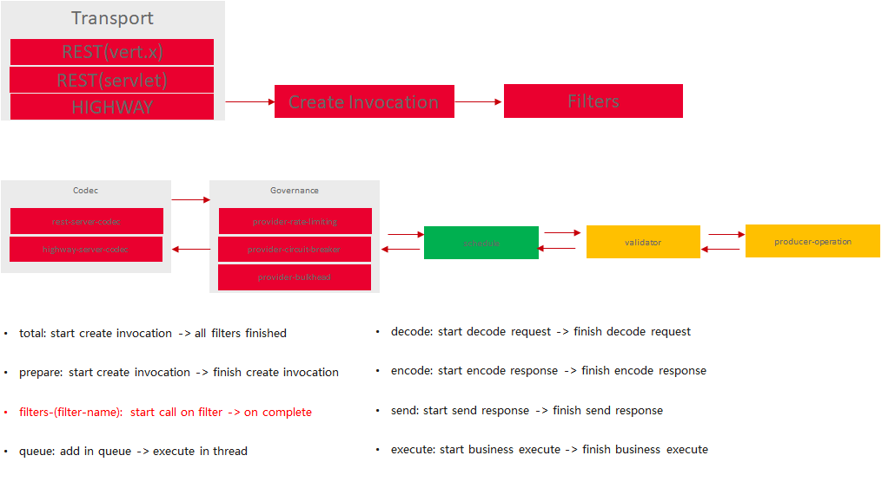
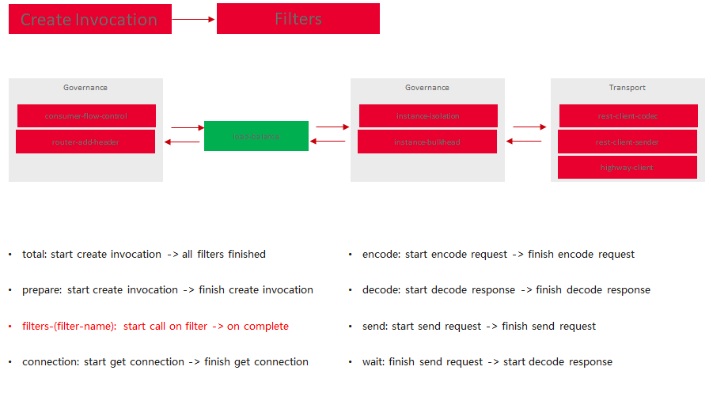
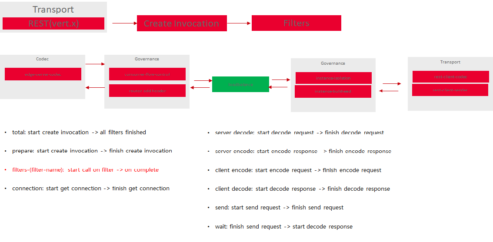

# 处理链介绍

处理链定义了一个请求的处理流程，包括编解码、服务治理、网络发送等。Java Chassis的核心处理流程分为 `Provider处理流程`、`Consumer处理流程`、`Edge处理流程`。

* Provider处理流程



* Consumer处理流程



* Edge处理流程



Java Chassis提供了 `ProviderFilter`、`ConsumerFilter`、`EdgeFilter` 分别对应上述处理流程。

## 开发新的处理链

`ProviderFilter`、`ConsumerFilter`、`EdgeFilter`的开发流程一样。开发者只需要实现上述接口，并将其声明为 Bean 即可。

* 实现Filter接口

```java
public class EmptyFilter extends AbstractFilter implements ProviderFilter, ConsumerFilter, EdgeFilter {
  @Override
  public String getName() {
    return "empty";
  }

  @Override
  public CompletableFuture<Response> onFilter(Invocation invocation, FilterNode nextNode) {
    return CompletableFuture.completedFuture(Response.ok(null));
  }

  @Override
  public int getOrder() {
    return 0;
  }
}
```

* 声明为 Bean

```java
@Configuration
public class EmptyFilterConfiguration {
  @Bean
  public EmptyFilter emptyFilter() {
    return new EmptyFilter();
  }
}
```

上述开发完成的处理链会在 `Provider处理流程`、`Consumer处理流程`、`Edge处理流程` 执行。 它的 order 是 0。 由于它继承了 `AbstractFilter`， 还可以在配置文件中
定义是否启用，或者定义其优先级。

```yaml
servicecomb:
  filter:
    # Filter名称
    empty:
      # 应用名 + 服务名
      ${application}.${name}.order: 10
      ${application}.${name}.enabled: false
```

