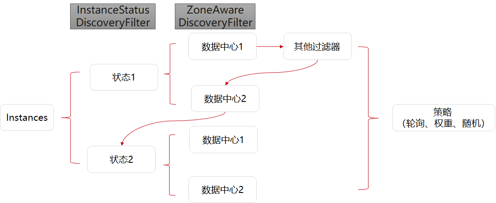

# 负载均衡

Java Chassis提供了强大的负载均衡能力, 在实例数非常多的场景，也能提供很好的性能。负载均衡的核心数据结构是 `DiscoveryTree`，`DiscoveryTree` 包含了一系列 `DiscoveryFilter`。  下图展示了负载均衡的处理过程：



## 按照数据中心信息进行路由转发
服务提供者和消费者都可以通过在microservice.yaml中声明自己的数据中心信息：
```yaml
servicecomb:
  datacenter:
    name: mydatacenter
    region: my-Region
    availableZone: my-Zone
```

消费者通过比较自己的数据中心信息和提供者的信息，优先将请求转发到region和availableZone都相同的实例；如果不存在，则转发到region相同的实例；如果仍然不存在，则转发到其他实例。

这里的region和availableZone是一般性的概念，用户可以自行确定其业务含义以便应用于资源隔离的场景中。可以参见[微服务实例之间的逻辑隔离关系](../build-provider/definition/isolate-relationship.md)，了解更多其他实例发现相关的隔离机制。

该规则默认启用，如果不需要使用，可以通过 `servicecomb.loadbalance.filter.zoneaware.enabled` 进行关闭。数据中心信息隔离功能在 `ZoneAwareDiscoveryFilter` 实现。

## 根据实例属性进行路由转发

微服务可以指定实例的属性。实例属性可以在microservice.yaml中指定，也可以通过服务中心的API进行修改。
```yaml
instance_description:
  properties:
    tags:
      tag_key: tag_value
```

消费者可以指定消费具备某些属性的实例，不访问其他实例
```yaml
servicecomb:
  loadbalance:
    provider:   # 这里表示配置对名为"provider"的服务生效，如果是跨应用调用，则还需要加上AppID，如"AppIDOfProvider:provider"
      transactionControl:
        options:
          tags:
            tag_key: expected_tag_value
```
上面的配置表示只访问myservice所有实例中`tag_key`属性为`expected_tag_value`的实例。

该规则需要给每个服务单独配置，未配置表示不启用该规则，不支持对于所有服务的全局配置。

该规则默认启用，如果不需要使用，可以通过`servicecomb.loadbalance.filter.instanceProperty.enabled`进行关闭。根据实例属性进行路由转发功能在`InstancePropertyDiscoveryFilter`实现。

## 根据实例属性值的层级进行路由转发

实例属性优先级匹配可以看做是针对实例属性匹配的一种逻辑扩展。

微服务的实例属性可以定义为具备优先级的格式，通过`.`符号进行分割。

```yaml
instance_description:
  properties:
    KEY: a.b.c
```

消费者需要指定用于优先级匹配的实例属性key，默认的key为`environment`。

```yaml
servicecomb:
  loadbalance:
    filter:
      priorityInstanceProperty:
        key: KEY
```

假设某个consumer的属性值为`a.b.c`，那么将会按照`a.b.c`>`a.b`>`a`>`[空]` 这样的优先级顺序匹配provider的实例，一旦匹配到即终止，下面的表格给出了不同情况的具体示例

| consumer | match priority of provider|
| :--- | :--- | 
|a.b.c|a.b.c>a.b>a>[空]|
|a.b|a.b>a>[空]|
|a|a>[空]|
|[空]|[空]|

> 注意[空]是一种特殊情况，即未设置该属性的实例

该规则默认关闭，如果需要开启，可以通过`servicecomb.loadbalance.filter.priorityInstanceProperty.enabled`配置打开。该功能在`PriorityInstancePropertyDiscoveryFilter`中实现。

## 配置路由规则

可以通过配置项指定负载均衡策略。
```yaml
servicecomb:
  loadbalance:
    strategy:
      name: RoundRobin # Support RoundRobin,Random,WeightedResponse,SessionStickiness
```

可以针对不同的微服务配置不一样的策略，只需要给配置项增加服务名，例如：
```yaml
servicecomb:
  loadbalance:
    myservice:
      strategy:
        name: RoundRobin # Support RoundRobin,Random,WeightedResponse,SessionStickiness
```

还可以针对不同的契约和操作配置不一样的策略，例如：
```yaml
servicecomb:
  loadbalance:
    myservice:
      myschema:
        myoperation:
          strategy:
            name: RoundRobin # Support RoundRobin,Random,WeightedResponse,SessionStickiness
```

每种策略还有一些专属配置项，也支持针对不同微服务进行配置。

* SessionStickiness

```yaml
servicecomb:
  loadbalance:
    SessionStickinessRule:
      sessionTimeoutInSeconds: 30 # 客户端闲置时间，超过限制后选择后面的服务器
      successiveFailedTimes: 5 # 客户端失败次数，超过后会切换服务器
```

## 自定义
负载均衡模块提供的功能已经非常强大，能够通过配置支持大部分应用场景。同时它也提供了强大的扩展能力，包括DiscoveryFilter、ServerListFilterExt、ExtensionsFactory（扩展RuleExt等）。负载均衡模块本身包含了每一个扩展的实现，这里不再详细描述如何扩展，只简单描述步骤。开发者可以自行下载Java Chassis源码进行参考。

* DiscoveryFilter
  * 实现DiscoveryFilter接口
  * 声明为Bean

* ServerListFilterExt
  * 实现ServerListFilterExt接口
  * 配置SPI：增加META-INF/services/org.apache.servicecomb.loadbalance.ServerListFilterExt文件，内容为实现类的全名
  * 注意：建议尽可能使用DiscoveryFilter，这个接口主要为了兼容。

* ExtensionsFactory
  * 实现ExtensionsFactory接口
  * 声明为Bean
