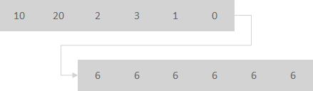

# Java Chassis 3技术解密：过载状态下的快速失败

在 `熔断机制的改进路程` 技术解密中，总结了如何设计一个优雅的熔断机制。 作为微服务最重要的治理策略之一，熔断机制能够在故障场景起到防止雪崩效应的作用。过载状态是一种特殊的故障场景，主要指超出了系统处理能力的请求量。 在过载状态，熔断机制可能无法起到预期的效果。 为了对过载状态下的防护有个比较直观的认识， 我们先讨论几个典型场景：

* 假设系统启用了熔断机制，并且设置了隔离仓来检测过载情况。 当系统流量过载的时候，隔离仓触发过载保护，熔断机制会短暂隔离对于实例的访问，并将流量转移到其他实例。 由于总的处理实例数减少，系统实际能够处理的负荷在熔断机制生效的场景下，会进一步降低。 这意味着，相较于没有熔断机制，过载场景熔断机制反而更容易触发雪崩效应。
* 实际业务场景中，一些接口比较耗时，其他接口都很快的情况非常常见。 如果对耗时接口开启隔离仓进行过载防护，会增加耗时接口的失败率；如果不开启过载防护，耗时接口的并发增加，直观的表现是用户响应时间的增加。在一些业务系统看来，用户体验的下降的影响远小于故障率增加的影响。 微服务治理策略对于这类系统，也可能带来适得其反的效果。 

在过载场景，不能进入熔断状态，这需要额外的保护机制来防止过载。 快速失败机制是防止过载的最常用手段，虽然存在性能要求不高的业务场景，快速失败会导致错误率提升这种看似矛盾的情况，但是没有让快速失败机制关上大门，恰当的快速失败并搭配业务上的重试的处理还可以明显改善用户体验。 快速失败机制的要求很简单，就是尽早的拒绝过载流量，尽可能减少过载流量占用的CPU和其他资源时间。

## 限流

限流是最常用的快速失败措施。 但有个细节经常会被忽略：流量经常是不均衡的，瞬时流量超过阈值，不代表这些流量就应该被拒绝掉。 一个良好的限流措施，需要对流量进行适当的梳理，以减少不必要的限流。 比如下图，限流的核心作用是将每个时间片内，不均匀的流量，变成均匀的流量。 



限流发生的时机越早越好。通常会在 edge service 应用限流策略。 

```yaml
## 服务治理配置
servicecomb:
  matchGroup:
    allOperation: |
      matches:
        - apiPath: 
            prefix: "/"
  rateLimiting:
  ## 限流器每1毫秒允许通过10个请求，如果一个请求超过1000毫秒没有获取到
  ## 许可，将被拒绝
    allOperation: |
      rate: 10
      limitRefreshPeriod: 1
      timeoutDuration: 1000
```

上述限流策略限制了单位时间内进入 edge service 的请求数量，并能对请求进行梳理。限制数量可能在应用程序生命周期过程中难于规划，需要通过系统性的性能测试来评估限制大小。 一个比较好的策略是通过并发数来限制流量。在 edge service， 可以限制发往某个下游的实例当前正在处理的请求数。 

```yaml
## 服务治理配置
servicecomb:
  matchGroup:
    allOperation: |
      matches:
        - apiPath: 
            prefix: "/"
  instanceBulkhead:
    ## 隔离仓限制正在处理的请求数为20个，新来的请求等待1000毫秒没有获取到许可，将被拒绝。
    allOperation: |
      maxConcurrentCalls: 100
      maxWaitDuration: 1000
```

相比较于单位时间内请求数， 当前正在处理的请求数能够很好的反馈当前的系统繁忙程度，因为一个请求的时延增加，会导致当前正在处理的请求数增加。对于CPU密集型任务， 可以设置稍微小一点的值；对于IO密集型任务，可以设置稍微大一点的值。 

## 线程池队列和连接池队列

在线程池入队和出队的时候，进行快速失败，也是非常常用而且比较有效的手段。 

```yaml
servicecomb:
  executor:
    default:
      maxQueueSize-per-group: 1000
```

上述配置限制了线程池的队列大小， 少量的过载请求会被排队，队列超限后就会快速拒绝并失败。 

```yaml
servicecomb:
  rest:
    server:
      requestWaitInPoolTimeout: 1000
```

Java Chassis在出队的时候，也会检测任务等待的时间。 如果等待时间过长， 也会立即拒绝该任务，避免额外的处理资源浪费。 

线程池队列不适用于edge service或者采用reactive定义接口的场景， 在reactive模式，通常的竞争资源是连接池，可以通过如下配置项控制连接池等待队列：

```yaml
servicecomb:
  rest:
    client:
      maxWaitQueueSize: 100
```

## 全局的超时检测

一般的RPC系统会针对请求发送到响应接收设置请求超时时间。 微服务系统结构通常的调用关系比较复杂。 比如一个请求链路可能涉及 a -> b -> c -> d。  如果我们的设计目标是请求处理时间小于30s， 如果在 b 接收到 a 的请求的时候， 发现已经处理了 30s， b完全可以不需要请求c来处理这个请求， 快速失败。 Java Chassis 能够在任务处理的关键阶段，进行全局的已经处理的时间检查。 

全局的超时检测可以处理对快速失败有非常特殊要求的业务场景，考虑到多数情况下都会很少使用，这里不在详细描述其技术细节， 感兴趣的开发者可以参考Java Chassis的开发指导。 

>>> 客户故事：系统毛刺（指系统中极低概率的请求缓慢或者处理超时）是困扰觉大多数应用的老大难问题。 因为导致系统毛刺的因素非常多，包括请求的分布不均衡、CPU调度的不可预期、垃圾回收等等。 系统毛刺给客户的用户体验评价带来很多负面的影响，整体请求成功率偏低，平均响应时延偏高。 为了改善毛刺，早期的主要机制是设置请求超时时间，包括设置某个具体微服务的请求超时时间，或者根据调用的顺序，配置逐级递减的超时时间。 超时时间的配置确实起到了快速失败的目的，然而在HTTP场景下，超时会导致关闭连接并重新建连，在大并发场景，会引入更长时间的毛刺和请求超时。 引入流量梳理和隔离仓机制后，系统毛刺问题和超时导致的连接重连问题得到了极大的改善。 
