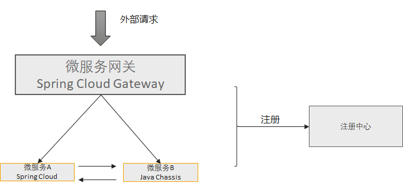

# Java Chassis 3技术解密：与Spring Cloud的互操作

Java Chassis 3一个很重要的设计原则：利用架构的韧性设计来解决兼容性问题。 


比如通过引入微服务网关，来解决不同语言、不同框架、遗留系统之间的互操作问题。 本文在这个架构原则基础上，讨论一个更加细粒度的互操作问题，并借此解密Java Chassis3在运行时设计依赖上的技术细节。

首先，我们描述一个互操作的场景和假设。 



* Spring Cloud和Java Chassis应用同时注册到注册中心。引入了Spring Cloud Gateway作为网关，网关也注册到注册中心。 
* Spring Cloud微服务和Java Chassis微服务相互调用。它们彼此作为消费者的时候，不需要感知对方是不同的框架，做到透明调用。 

从技术原理上梳理下上述互操作需要满足的条件：

* Spring Cloud和Java Chassis需要有相互认识的注册信息。核心包括：应用名称、服务名称、地址信息和格式等。 需要的共同注册中心越少，越容易对注册中心和客户端进行选型。 在本例子中，我们选择 `Service Center` 或者 `Nacos` 作为注册中心，并选择Spring Cloud Huawei实现Spring Cloud注册。 
* Spring Cloud访问Java Chassis，只需要一个地址信息，依赖较少。 Java Chassis访问Spring Cloud，需要知道Spring Cloud应用提供的契约信息。 

Java Chassis区别于Spring Cloud的REST调用的部分，就是契约依赖。 Spring Cloud通过FeignClient来声明客户端契约，客户端都需要在FeignClient中重复书写REST标签；Java Chassis有两种模式发现契约：从注册中心发现和从Provider实例发现。 Java Chassis3默认采用从Provider实例发现， Java Chassis2采用从注册中心发现。 从Provider发现的好处是可以降低对于注册中心元数据管理能力的要求，本例既可以采用 `Service Center` 作为注册中心，也可以选择 `Nacos` 作为注册中心。 

从Provider发现，要求Provider实现如下接口：

```java
/**
 * Java Chassis internal management apis.
 */
@Path("/scb/management")
public interface ManagementEndpoint {
  String NAME = "scb-management";

  /**
   * Health of this instance. If the instanceId match this instance, and this service is ready
   * to service return true. Otherwise, return false.
   *
   * This api is for internal instance status usage. Load balancer will call this api to check if
   * the target instance is alive.
   */
  @GET
  @Path("/health")
  boolean health(@QueryParam("instanceId") String instanceId, @QueryParam("registryName") String registryName);

  /**
   * Schemas of this instance.
   *
   * This api is for internal schema loading usage.
   */
  @POST
  @Path("/schema/contents")
  Map<String, String> schemaContents();
}
```

它包含一个健康检查接口和一个查询契约的接口。 当Spring Cloud应用实现上述接口以后，它就具备了Java Chassis微服务需要的基础特征，这样Java Chassis就可以像访问本框架的微服务一样访问Spring Cloud框架开发的微服务应用。 为了简化，在Spring Cloud简单实现了该接口，该实现接口从 `export` 目录加载契约信息，只需要将Spring Cloud需要对外暴露的 REST 接口的符合 Open API 3.0规范的契约文件放到这个目录下面 。

```java
@RestController
@RequestMapping(("/scb/management"))
public class JavaChassisManagementEndpoint {
  private static final Logger LOGGER = LoggerFactory.getLogger(JavaChassisManagementEndpoint.class);

  @Autowired
  private Registration registration;

  @GetMapping(path = "/health")
  public boolean health(@RequestParam("instanceId") String instanceId,
      @RequestParam("registryName") String registryName) {
    return "sc-registry".equals(registryName) && registration.getInstanceId().equals(instanceId);
  }

  @PostMapping(path = "/schema/contents")
  public Map<String, String> schemaContents() {
    try {
      List<URI> resourceUris = ResourceUtil.findResourcesBySuffix("export", ".yaml");
      Map<String, String> result = new HashMap<>(resourceUris.size());
      for (URI uri : resourceUris) {
        String path = uri.toURL().getPath();
        String[] segments = path.split("/");
        if (segments.length < 2 || !"export".equals(segments[segments.length - 2])) {
          continue;
        }
        result.put(segments[segments.length - 1].substring(0, segments[segments.length - 1].indexOf(".yaml")),
            IOUtils.toString(uri, StandardCharsets.UTF_8));
      }
      return result;
    } catch (IOException | URISyntaxException e) {
      LOGGER.error("Load schema ids failed from microservices. {}.", e.getMessage());
      return Collections.emptyMap();
    }
  }
}
```

Java Chassis与Spring Cloud互操作的例子放到了[ServiceComb Samples](https://github.com/apache/servicecomb-samples/tree/master/java-chassis-interoprability) ， 这个例子也提供了使用 Nacos 作为注册中心和配置中心的实现， 只需要将 Profile 设置为 Nacos 即可。 

>>> 客户故事：在架构选型变化的时候，解决功能迁移和兼容性问题是最大的挑战。一些客户将Spring Cloud应用改造为Java Chassis的过程中，发现一些功能不支持，比如SseEmitter、WebSocket等。 如果选择支持这些能力，Java Chassis需要实现很多Servlet能力，这些能力规划会和微服务技术架构存在冲突。 对于这些场景，我们选择通过架构韧性来保留这些功能，比如将提供SseEmitter、WebSocket功能的独立出微服务，采用Spring Boot开发，这些应用可以通过调用Java Chassis微服务的REST接口来实现其特殊功能。通过这种架构韧性的理念，降低了技术持续演进的包袱，为敏捷迭代，持续创新奠定了方向，减少了兼容性问题的争论。 


