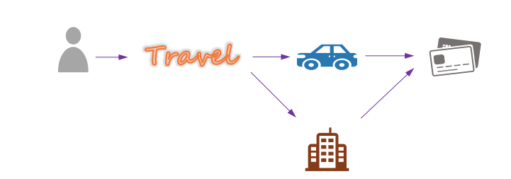
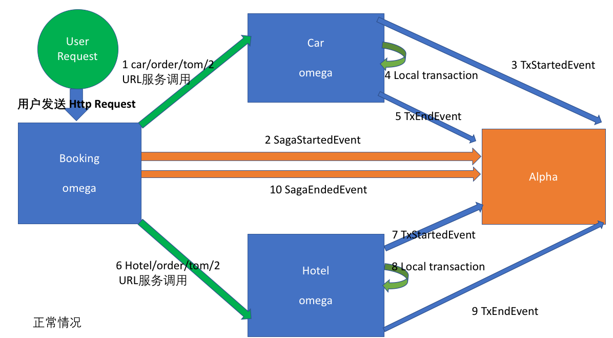
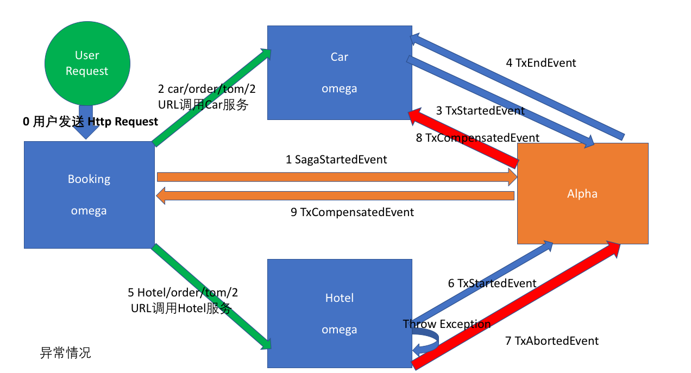
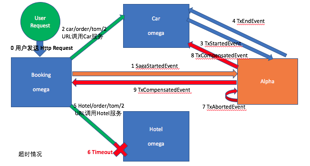
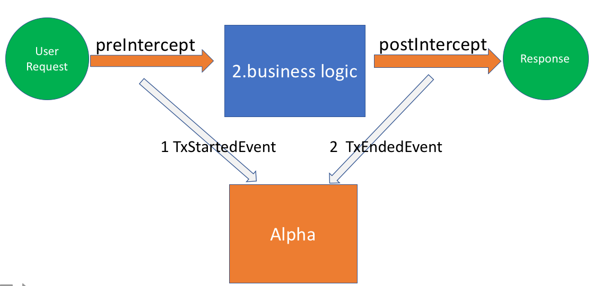

# Apache ServiceComb Pack ：Saga Spring Demo 代码解读
### [Saga-servicecomb-demo](https://github.com/apache/servicecomb-pack/tree/master/demo/saga-spring-demo) 背景介绍的ServiceComb Pack

为了更好的学习Apache ServiceComb Pack，saga-spring-demo设定一个实际需要分布式一致性的业务场景来方便理解。  
上图中：用户对预定服务Booking发起请求，其中租车订单服务car和酒店订单服务hotel没有依赖关系，租车服务是不知道酒店服务的执行情况。 对于预订服务来说，如果没有相关的服务调用协调机制的话，预订服务是很难保证其调用的租车服务以及酒店服务要么同时成功，要么同时失败。  

### Demo中的Saga实用场景
上图中:Pack架构中包含两个重要组件，即Omega客户端和Alpha服务端, 另外还有用来持久化的DB。  
结合图一：Demo中有三个独立进程服务，订单服务booking、租车服务car、酒店服务hotel，这些服务进程中均包含了omega客户端，Omega客户端会向Alpha服务端发送服务调用的消息，这样alpha服务端充当协调器协调这些服务之间的调用。  

##### Omega内嵌各Service进程中,主要负责：
* 监控本地事务执行情况，并以Event形式向alpha上报事务执行状态。  
* 异常情况下根据alpha下发的指令执行相应的补偿操作。    

##### Alpha充当协调者的角色，主要负责:
* 对本地事务的事件进行持久化存储。  
* 在本地事务与全局事务出现不一致的情况下，Alpha会回调相关Omega进行补偿（最终保持全局事务一致）。  

例：当异常情况下，如ServiceB的事务执行失败，Alpha扫描到Omega发送的TxAbortedEvent事件，就会回调ServiceA的补偿方法，执行自定义回滚逻辑，使各服务回到事务执行之前的状态。  

##### 现在我们具体看看saga-spring-demo涉及到的Saga事件。

## Saga中的Event简介
[EventType事件参考代码](https://github.com/apache/servicecomb-pack/blob/master/pack-common/src/main/java/org/apache/servicecomb/pack/common/EventType.java)

* SagaStartedEvent: 代表Saga事务的开始，Alpha接受到该事件会保存整个saga事务的执行上下文，其中包括多个本地事务/补偿请求  
* TxStartedEvent: 本地事务开始事件，其中包含了本地事务执行的上下文（调用方法名，以及相关调用参数）
* TXEndedEvent: 本地事务结束事件  
* TxAbortedEvent: 本地事务执行失败事件，包含了事务执行失败的原因  
* TxCompensatedEvent: 本地事务补偿事件，Alpha会将本地事务执行的上下文传递给Omega，这样不需要Omega自己维护服务调用的状态。
* SagaEndedEvent: 标志着saga事务请求的结束  

成功场景下，全局事务事件SagaStartedEvent对应SagaEndedEvent ，每个子事务开始的事件TxStartedEvent都会有对应的结束事件TXEndedEvent。

异常场景下，Omega会向Alpha上报中断事件TxAbortedEvent，然后Alpha会根据全局事务的执行情况， 想其它已成功的子事务(以完成TXEndedEvent)的服务发送补偿指令，以确保最终所有的子事务要么都成功，要么都回滚。

超时场景下，已超时的事件会被alpha的定期扫描器检测出来，同时该超时事务对应的全局事务也会被中断。  

1.用户发送Request请求调用业务方法(business logic)  
2.preIntercept向alpha发送TxStartedEvent  
3.被AOP拦截的方法(business logic)被调用  
4.当执行成功时postIntercept发送TxEndedEvent到alpha  
5.最后业务方法向用户发送response  
